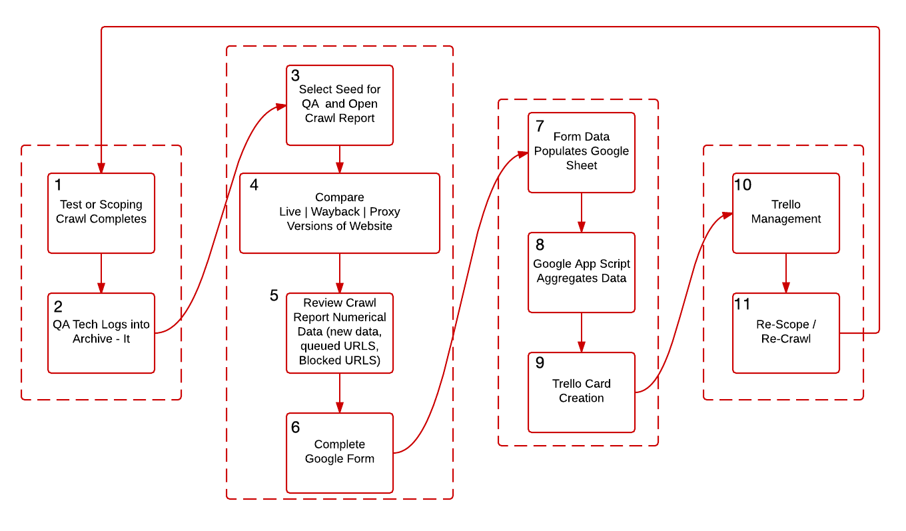

# New Seed QA
Every time you add a new seed to the archive it must undergo full quality assurance to ensure the capture of the website is complete. The general workflow for quality assurance of a new site is outlined below:

### Google QA Form
For each collection in Archive-It we have created an affiliated Google Form to assist in recording the results of the quality assurance tasks relevant to that collection. This form documents QA findings and creates Trello cards that allow us to track and manage any QA issues that arise from the crawl. An example form can be found [here](https://www.go.ncsu.edu/qa-demo).

### Qualitative QA Analysis
The purpose of qualitative QA analysis is to ensure that the captured site renders similarly to the 'live' site it was meant to capture. In order to perform qualitative QA analysis on any captured site you need to open up the 'live' site as well as the wayback capture of the site (linked to from the crawl report). You want to compare the following:

- Images
- Navigation Items
- Layout
- Video
- Content

It is possible, on quickly changing sites, that images and content on the archived site may be different from what you see on the live site. You will still want to make sure that images and content appear to be working correctly on the archived site.

### Quantitative QA Analysis
The crawl report contains a lot of data related to the crawl. This data can be used to help determine if a crawl was effective or not. When looking at the crawl report pay attention to these indicators:

- New Data - This is the amount of new data collected during the crawl, this amount of data will go towards your total subscription data budget.
- Hosts - This lists the individual hosts where content for the page was pulled from, it is helpful in determining if certain content is blocked, what needs to be added as a scope expansion rule.
- Queued URLs - This is the number of URLs that the crawler detected should be crawled, but were not crawled due to crawl limits. Often if this is a high number it is the result of a crawler trap.
- Blocked URLs - URLs that are blocked from the crawler, either by scoping rules or by a robot.txt file
